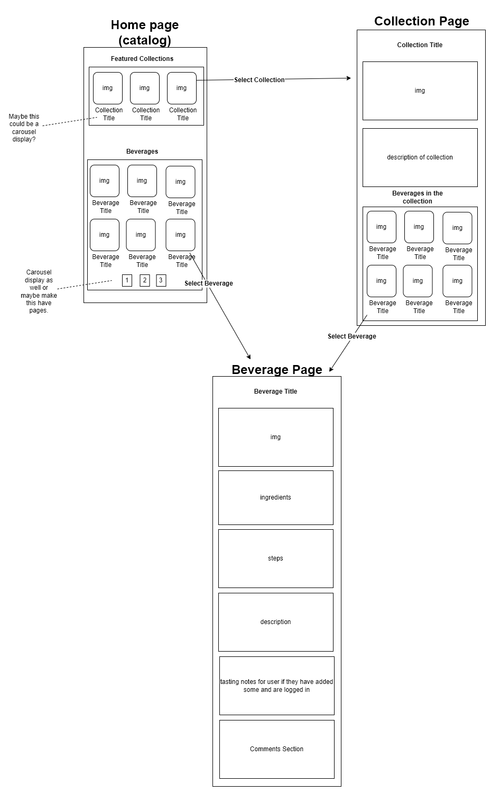
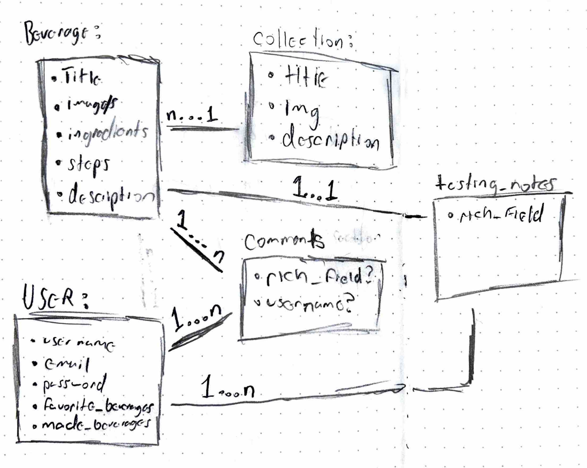

# README

This README would normally document whatever steps are necessary to get the
application up and running.

Things you may want to cover:

* Ruby version: 3.4.1

* System dependencies: Ruby 3.4.1, Rails 8.0.1

* Configuration: TailwindCSS, PostgreSQL

* Database creation

* Database initialization

* How to run the test suite

* Services (job queues, cache servers, search engines, etc.)

* Deployment instructions

* ...

Initial specification (01/24/2025)

This section is an initial specification to roughly plot out what Buzzy's Bar
will be and will need. These initial guesses are likely to off as the
application develops iteratively, making these rough specifications early allows
us to to focus on what to work on first and how to sequence our iterations. 

What Buzzy’s Bar does

Actors:
	Curators
	Members

Curators:
	The curator uses Buzzy's Bar to create Beverage listings, and collections of
  beverage listings (I.E. a holiday beverages collection). These listings would
  include details for the beverage, such as images, a thumbnail image,
  description, and details on how to make the beverage. Collections would
  include an organized display of individual listings grouped together based on
  a theme. Curators will also be able to remove any comments made on listing by
  members for moderation purposes.

Members:
	The member uses Buzzy’s Bar to view Beverage listings, mark beverage listings
  as favorites, view their favorite beverages, mark beverages as made before,
  view their previously made beverages, comment on listings in a comment
  section, view comments on listings, add their tasting notes to a beverage
  listing (which shows up only for that specific member), and search for
  beverages by name or category.

Rudimentary page flow:

Rudimentary data:
